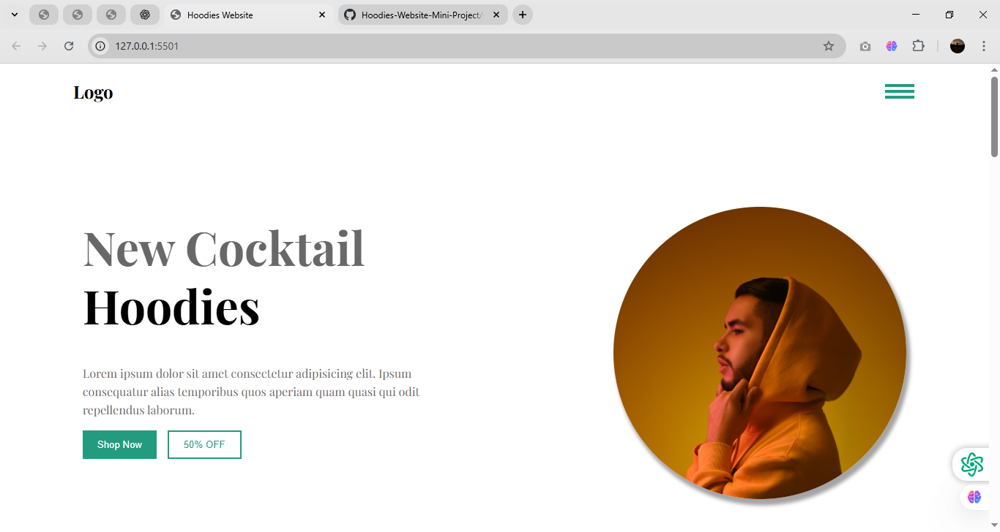

# Hoodies Landing Page

A **responsive landing page for Hoodies** built using **HTML** and **CSS**.  
The base project was created by following the **HuXn WebDev YouTube tutorial**, and I extended it by adding **custom responsive styles** for **mobile and tablet devices**.

---

## 🌐 Live Demo
[View Website](https://your-hosted-link.com)  
*(Replace with your actual hosting link)*

---

## 🖼 Preview

### 🏠 Homepage (Desktop View)

---

## 📌 Features
- Clean and modern hoodie landing page  
- Responsive for:
  - 📱 Mobile screens (≤414px)
  - 📖 Tablet screens (415px – 700px)
  - 💻 Laptop/Desktop screens (≥1024px)  
- Sections suitable for product showcasing & branding  

---

## 🛠 Tech Stack

---

## 🚀 What I Learned
- Applying **CSS media queries** to handle multiple screen sizes  
- Making a **non-responsive design fully responsive**  
- Optimizing layouts for **mobile, tablet, and laptop users**  

---

## 📚 Credits
- Tutorial Base: [HuXn WebDev YouTube Channel]([https://www.youtube.com/@HuXnWebDev](https://www.youtube.com/watch?v=aWJyfsoow6w))  
- Responsive enhancements (mobile + tablet breakpoints): **Saurabh Patil**

---

### 📩 Feedback
Suggestions and improvements are always welcome! 

